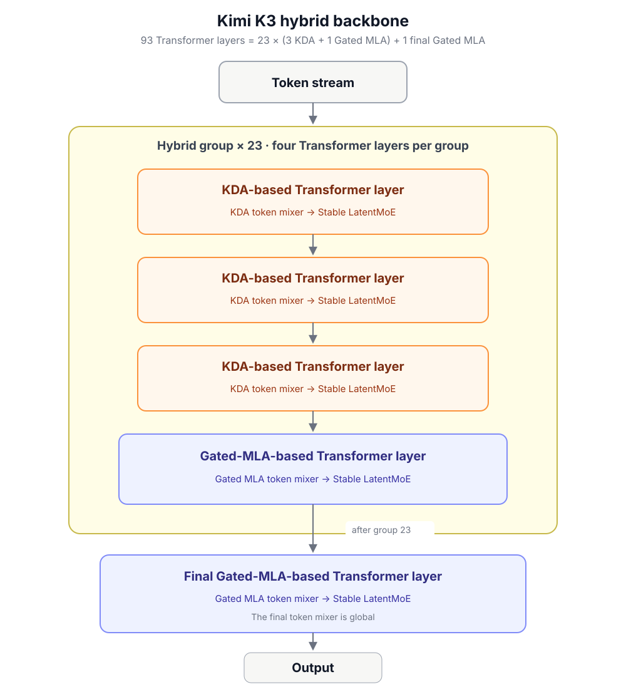
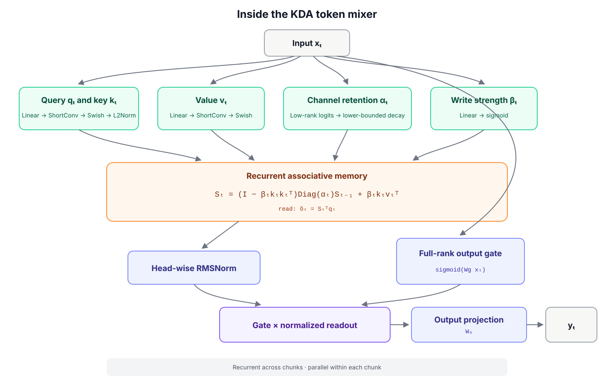
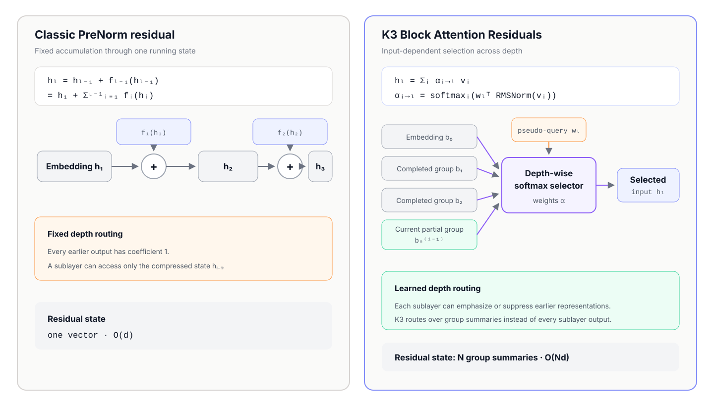

# Recurrent Transformer

Linear attention can be viewed as a recurrent key-value memory. Its evolution is mainly a story of increasingly precise control over what that fixed-size state retains.

Here, `Sₜ ∈ ℝᵈᵏˣᵈᵛ` is the recurrent memory, `kₜ`, `vₜ`, and `qₜ` are the key, value, and query, `βₜ` is the write strength, and `αₜ` is the forget gate; the readout is `oₜ = Sₜᵀqₜ`. Gated DeltaNet uses a scalar `αₜ`, while KDA promotes it to a vector and applies `Diag(αₜ)`.

## Kimi K3 architecture

Kimi K3 has 93 Transformer layers. It organizes them as 23 hybrid groups of four layers—three KDA-based layers followed by one Gated-MLA-based layer—then adds one final Gated-MLA-based layer. This gives 69 KDA and 24 Gated MLA layers in total.

Each box inside a hybrid group is one complete Transformer layer: a token mixer followed by a Stable LatentMoE channel mixer. Normalization and Attention Residual routing are omitted from this overview; AttnRes lets modules retrieve from the embedding, earlier groups, and the current partial group instead of relying only on the immediately preceding residual stream.

### Inside the KDA token mixer

This expands only the KDA token-mixing component of a KDA-based Transformer layer—not the entire layer or its Stable LatentMoE component.

Kimi K3 keeps the KDA recurrence from Kimi Linear but bounds the decay and uses a full-rank, input-dependent output gate. The recurrence is sequential across chunks and parallel within each chunk.

### Attention Residuals: routing across depth

Attention Residuals (AttnRes) operate across network depth, not across token positions. Standard PreNorm residuals pass one running sum from sublayer to sublayer; AttnRes lets each attention or MoE sublayer select useful earlier representations with learned, input-dependent weights.

| | Classic PreNorm residual | K3 Block AttnRes |
|---|---|---|
| Depth update | `hₗ = hₗ₋₁ + fₗ₋₁(hₗ₋₁)` | `hₗ = Σᵢ αᵢ→ₗ vᵢ` |
| Routing | Fixed coefficient `1` for every earlier output | `αᵢ→ₗ = softmaxᵢ(wₗᵀ RMSNorm(vᵢ))` |
| Accessible history | One compressed running state | Embedding, completed groups, current partial group |
| Residual state | `O(d)` | `O(Nd)` for `N` group summaries |

Full AttnRes uses every preceding sublayer output as a candidate. Kimi K3 uses Block AttnRes to route over group-level summaries, retaining most of the selective depth access without the `O(Ld)` residual-state cost of the full form.

## References

- [Transformers are RNNs: Fast Autoregressive Transformers with Linear Attention](https://arxiv.org/abs/2006.16236) — Katharopoulos et al., 2020
- [Linear Transformers Are Secretly Fast Weight Programmers](https://proceedings.mlr.press/v139/schlag21a.html) — Schlag et al., 2021
- [Gated Delta Networks: Improving Mamba2 with Delta Rule](https://arxiv.org/abs/2412.06464) — Yang et al., ICLR 2025
- [Kimi Linear: An Expressive, Efficient Attention Architecture](https://arxiv.org/abs/2510.26692) — Kimi Team, 2025
- [Attention Residuals](https://arxiv.org/abs/2603.15031) — Kimi Team, 2026
- [Kimi K3: Open Frontier Intelligence](https://arxiv.org/abs/2607.24653) — Kimi Team, 2026
