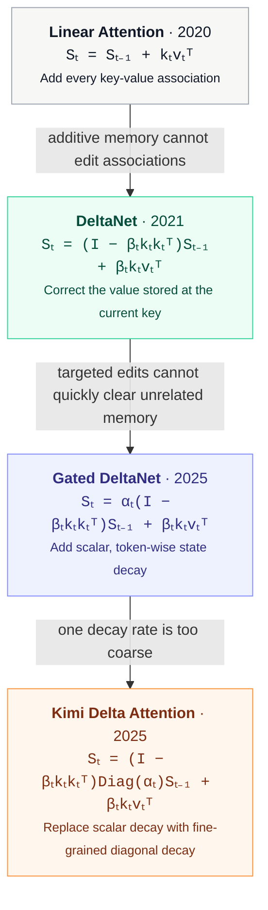

# Stateful Transformer

Linear attention can be viewed as a recurrent key-value memory. Its evolution is mainly a story of increasingly precise control over what that fixed-size state retains.

Here, `Sₜ ∈ ℝᵈᵏˣᵈᵛ` is the recurrent memory, `kₜ`, `vₜ`, and `qₜ` are the key, value, and query, `βₜ` is the write strength, and `αₜ` is the forget gate; the readout is `oₜ = Sₜᵀqₜ`. Gated DeltaNet uses a scalar `αₜ`, while KDA promotes it to a vector and applies `Diag(αₜ)`.

## References

- [Transformers are RNNs: Fast Autoregressive Transformers with Linear Attention](https://arxiv.org/abs/2006.16236) — Katharopoulos et al., 2020
- [Linear Transformers Are Secretly Fast Weight Programmers](https://proceedings.mlr.press/v139/schlag21a.html) — Schlag et al., 2021
- [Gated Delta Networks: Improving Mamba2 with Delta Rule](https://arxiv.org/abs/2412.06464) — Yang et al., ICLR 2025
- [Kimi Linear: An Expressive, Efficient Attention Architecture](https://arxiv.org/abs/2510.26692) — Kimi Team, 2025
